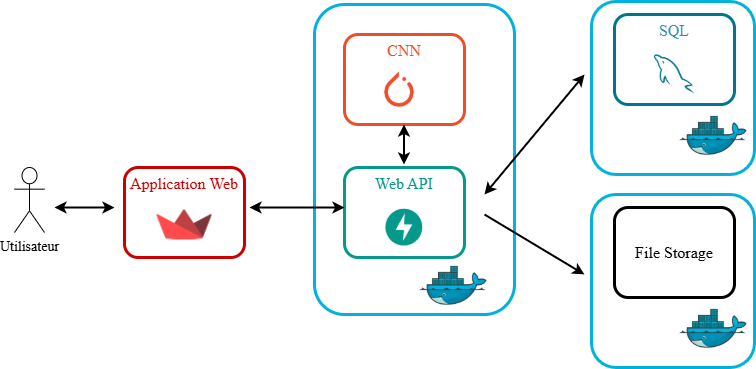

# 🛰️ **Atelier CNN - Classification d'Images Satellites**

## **Déploiement d'un modèle IA via une Web API**
Déployer un modèle d'intelligence artificielle via une **API** permet de le rendre **accessible, scalable et facilement intégrable** dans divers systèmes, sans avoir besoin de le redéployer à chaque utilisation.

### **Principaux avantages :**
- **Accessibilité** → Toute application (web, mobile, backend) peut envoyer des requêtes et obtenir des prédictions en temps réel.
- **Scalabilité** → L’API permet d’héberger le modèle sur un serveur centralisé et de gérer plusieurs requêtes simultanément.
- **Mise à jour simplifiée** → On peut améliorer ou remplacer le modèle sans impacter les utilisateurs finaux.
- **Interopérabilité** → Le modèle peut être utilisé par des applications écrites dans différents langages (Python, JavaScript, Java…).
- **Sécurité** → L'API contrôle qui peut accéder au modèle et protège les données sensibles.

**Exemple d’utilisation :**  
Un modèle de **classification d’images satellites** peut être exposé sous forme d'API REST. Une application web peut alors envoyer une image via une requête **HTTP POST**, et l’API renvoie un label (`Forêt`, `Mer`, `Désert`, `Nuageux`) en réponse.


## **FastAPI**
[FastAPI](https://fastapi.tiangolo.com/) est un **framework Python rapide et performant** pour créer des **API RESTful**. Il est idéal pour **exposer un modèle d'IA**, car il permet :
- de gérer facilement les requêtes HTTP,
- d'assurer une **exécution asynchrone optimisée**,
- d'intégrer automatiquement une **documentation interactive** (`/docs`).

### **Endpoint dans FastAPI**
Un **endpoint** est une route définie dans FastAPI qui répond à une requête HTTP (`GET`, `POST`…).  
Il permet d’exécuter une fonction spécifique, comme **recevoir une image et retourner une prédiction** d’un modèle d’IA.

### **Uvicorn**
[Uvicorn](https://www.uvicorn.org/) est un **serveur ASGI** (Asynchronous Server Gateway Interface) qui exécute les applications **FastAPI** de manière **ultra-rapide** et **asynchrone**.  
Il est essentiel pour **servir l’API en production** et gérer efficacement les requêtes entrantes.

---

## **Développement de la Web API**
Le code source de l’API se trouve dans le répertoire **`cnn_app/api`**.

### **Installation de l’environnement**
Sur votre machine, commencez par **créer et activer un environnement virtuel** dans ce répertoire :
```bash
python -m venv venv
source venv/bin/activate  # Sur macOS/Linux
venv\Scripts\activate  # Sur Windows
```

### **Installation des dépendances**
Installez les bibliothèques nécessaires à l'API :
```bash
pip install --upgrade -r requirements.txt
```

### **Ajout du modèle de classification**
- **Copiez le fichier `.pth`** (poids du modèle) dans le répertoire :  
  `cnn_app/api/app/modele/`
- Ce fichier contient un **dictionnaire d'état du modèle**, stockant les **poids et biais** des couches du réseau de neurones.

### **Configuration et chargement du modèle**
**Ouvrir et compléter `cnn.py`**
Dans le fichier `cnn.py`, ajoutez le code suivant dans le bloc `try` pour **charger le modèle MobileNetV3** :

```python
# Recréer l'architecture du modèle
model = models.mobilenet_v3_small(weights=models.MobileNet_V3_Small_Weights.DEFAULT)

# Modifier la dernière couche du classificateur pour correspondre au nombre de classes
num_classes = 4  # Nombre de classes : Forêt, Mer, Désert, Nuageux
model.classifier[3] = torch.nn.Linear(in_features=1024, out_features=num_classes)
```
**Pourquoi ?**  
Le modèle **MobileNetV3** propose **1000 classes par défaut**.  
Nous ajoutons une **couche supplémentaire** pour correspondre au **nombre réel de classes**.

### **Charger les poids du modèle**
Ajoutez ensuite le code suivant pour **charger le fichier `.pth`** et activer le mode évaluation :

```python
model_path = "app/modele/model.pth"  # Chemin du fichier .pth
model.load_state_dict(torch.load(model_path, map_location=torch.device("cpu")), strict=False)
model.eval()  # Mode évaluation pour la prédiction
```

**Pensez à bien renseigner le chemin correct vers votre fichier `.pth` !**

### **Prétraitement de l’image pour la prédiction**
Après le `try: except:`, ajoutez le code suivant pour **préparer l’image** :

```python
# Retrouver la transformation utilisée pour entraîner le modèle
transform = transforms.Compose([
    transforms.Resize((224, 224)),
    transforms.ToTensor(),
    transforms.Normalize(mean=[0.485, 0.456, 0.406], std=[0.229, 0.224, 0.225])
])

image = Image.open(file_path).convert("RGB")
image = transform(image).unsqueeze(0)  # Ajoute une dimension batch
```

**Ce code applique les mêmes transformations** que celles utilisées lors de l'entraînement.


### **Interprétation des résultats**
Enfin, ajoutez ce code pour **effectuer la prédiction** :

```python
output = model(image)
_, predicted = torch.max(output, 1)

LABELS = {0: "Forêt", 1: "Mer", 2: "Désert", 3: "Nuageux"}
return LABELS[predicted.item()]
```

`predicted.item()` **contient l’indice de la classe prédite**, qu’on convertit en label grâce au **dictionnaire `LABELS`**.

## **Mise en place de l'API**
**Fichier `config.py`**
Ce fichier stocke les **constantes de configuration**.  
Par exemple, le dossier où enregistrer les images :
```python
UPLOAD_FOLDER = "app/uploads"
```

### **Fichier `main.py`**
Ce fichier contient le **code de l’API FastAPI**. Exemple de route :
```python
from fastapi import FastAPI

app = FastAPI()

@app.get("/")
async def index():
    return "API Prediction!"
```

### **Endpoint FastAPI pour l’upload d’images**
```python
import os
import shutil
from fastapi import UploadFile, File, HTTPException

os.makedirs(UPLOAD_FOLDER, exist_ok=True)

@app.post("/predictions/satellite/")
async def upload_image(file: UploadFile = File(...)):
    file_path = os.path.join(UPLOAD_FOLDER, file.filename)

    if not file.filename.endswith(("jpg", "jpeg", "png")):
        raise HTTPException(status_code=400, detail="Format non supporté")

    with open(file_path, "wb") as buffer:
        shutil.copyfileobj(file.file, buffer)

    label = predict_image(file_path)  # Prédiction
    return {"filename": file.filename, "prediction": label}
```

### **Tester l'API**
**Lancer le serveur :**
```bash
uvicorn app.main:app --reload --host 0.0.0.0 --port 8081
```
**Tester l’API dans le navigateur :**
Accédez à la documentation interactive :  
`http://127.0.0.1:8081/docs`

**Vous pouvez maintenant tester l’upload d’images et obtenir des prédictions !**
