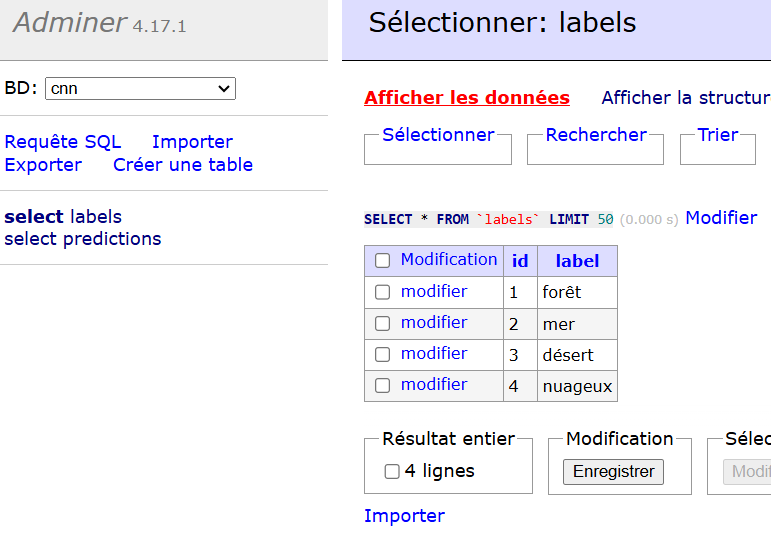

# 🛰️ **Atelier CNN - Classification d'Images Satellites**  

## **Pourquoi structurer les données pour l'IA en passant par une base de données ?**  
L’utilisation d’une **base de données** pour stocker les **prédictions d’un modèle d’IA** permet de :  
- **Stocker l’historique des prédictions** pour analyse.  
- **Gérer et structurer les données** de manière centralisée.  
- **Faciliter l’accès aux résultats** pour d'autres services ou applications.  
- **Améliorer le suivi et la gestion** des modèles en production.


---

## **Création de la base de données avec Docker**
Nous allons utiliser **Docker** pour créer une base **MySQL** et un outil d'administration **Adminer**.

### **Configuration du `docker-compose.yml`**
Ce fichier permet de **démarrer et configurer la base de données MySQL** et **Adminer**.

```yaml
version: "3.9"

services:
  db:
    image: mysql
    container_name: db_cnn
    environment:
      - MYSQL_ROOT_PASSWORD=example
      - MYSQL_DATABASE=cnn 
      - MYSQL_USER=cnn_user
      - MYSQL_PASSWORD=cnn_pwd
    ports:
      - 3306:3306
    volumes:
      - ./db/databases:/var/lib/mysql
      - ./db/init.sql:/docker-entrypoint-initdb.d/init.sql
    restart: always

  adminer:
    image: adminer
    container_name: adminer_cnn
    restart: always
    ports:
      - 8080:8080
```
**Adminer** permet de **visualiser et manipuler** la base via une interface web (`http://localhost:8080`).

### **Script SQL d’initialisation (`init.sql`)**
Ce fichier crée les **tables nécessaires** et **insère les labels** pour la classification des images satellites.

```sql
-- Initialisation de la base de données MySQL
USE `cnn`;

SET NAMES utf8mb4;

CREATE TABLE IF NOT EXISTS `predictions` (
  `id` int NOT NULL AUTO_INCREMENT,
  `image` varchar(100) NOT NULL,
  `label` int NOT NULL,
  `commentaire` varchar(100) NOT NULL,
  `modele` varchar(100) NOT NULL,
  PRIMARY KEY (`id`),
  KEY `label` (`label`),
  CONSTRAINT `images_ibfk_1` FOREIGN KEY (`label`) REFERENCES `labels` (`id`)
) ENGINE=InnoDB DEFAULT CHARSET=utf8mb4 COLLATE=utf8mb4_0900_ai_ci;

CREATE TABLE IF NOT EXISTS `labels` (
  `id` int NOT NULL AUTO_INCREMENT,
  `label` varchar(100) NOT NULL,
  PRIMARY KEY (`id`)
) ENGINE=InnoDB DEFAULT CHARSET=utf8mb4 COLLATE=utf8mb4_0900_ai_ci;

INSERT INTO `labels` (`label`) VALUES
('forêt'),
('mer'),
('désert'),
('nuageux');
```

### **Lancer la base de données**
```bash
docker-compose up -d
```
**Vous pouvez ensuite utiliser Adminer** (`http://localhost:8080`) pour vérifier que la base est bien créée.



## **Modification de l’API pour utiliser la base de données**
Nous allons **modifier l’API FastAPI** pour **enregistrer et récupérer les prédictions** depuis la base de données.

### **Configuration de la base de données dans `config.py`**
Ajoutez les paramètres de connexion à MySQL.

```python
UPLOAD_FOLDER = "satelite_images"   # Répertoire de stockage des images

LABELS = {0: "nuageux", 1: "désert", 2: "forêt", 3: "mer"}

DB_NAME = "cnn"
DB_USER = "cnn_user"
DB_PASSWORD = "cnn_pwd"
DB_HOST = "localhost"
DB_PORT = "3306"
```

### **Création d’un module pour la gestion de la base**
Créez un **répertoire `bdd/`** et ajoutez **`connexion.py`** pour gérer la connexion à la base.

### **Fichier `connexion.py` (Connexion MySQL)**
```python
import mysql.connector as mysqlpyth
from app.config import DB_USER, DB_PASSWORD, DB_HOST, DB_PORT, DB_NAME

class Connexion:

    @classmethod
    def ouvrir_connexion(cls):
        cls.bdd = mysqlpyth.connect(user=DB_USER, password=DB_PASSWORD, host=DB_HOST, port=DB_PORT, database=DB_NAME)
        cls.cursor = cls.bdd.cursor(dictionary=True)

    @classmethod
    def fermer_connexion(cls):
        if hasattr(cls, "cursor") and cls.cursor:
            cls.cursor.close()
        if hasattr(cls, "bdd") and cls.bdd:
            cls.bdd.close()
```

### **Création d’un modèle de prédiction (`prediction.py`)**
Définit la structure des prédictions stockées en base.

```python
from pydantic import BaseModel

class Prediction(BaseModel):
    id: int = None
    image: str
    label: str
    commentaire: str
    modele: str
```

### **Ajout d’un service pour gérer les prédictions (`service.py`)**
```python
from app.bdd.connexion import Connexion
from app.bdd.prediction import Prediction

class Service_Prediction(Connexion):

    @classmethod
    def sauvegarder_prediction(cls, prediction: Prediction):
        try:
            cls.ouvrir_connexion()
            query = "SELECT id FROM labels WHERE label = %s"
            cls.cursor.execute(query, [prediction.label])
            label = cls.cursor.fetchone()["id"]

            query = "INSERT INTO predictions (image, label, commentaire, modele) VALUES (%s, %s, %s, %s)"
            values = [prediction.image, label, prediction.commentaire, prediction.modele]
            
            cls.cursor.execute(query, values)
            cls.bdd.commit()

        except Exception as e:
            print(f"Erreur : {e}")
        
        finally:
            cls.fermer_connexion()

    @classmethod
    def lister_predictions(cls):
        predictions = []
        try:
            cls.ouvrir_connexion()
            query = "SELECT predictions.image, labels.label, predictions.commentaire, predictions.modele FROM predictions JOIN labels ON predictions.label = labels.id"
            cls.cursor.execute(query)
            for row in cls.cursor:
                predictions.append(Prediction(**row))

        except Exception as e:
            print(f"Erreur : {e}")
        
        finally:
            cls.fermer_connexion()

        return predictions
```

## **Modification de l’API FastAPI**
Nous allons **modifier le endpoint existant** pour enregistrer les prédictions en base et ajouter un **nouveau endpoint** pour les récupérer.

### **Mise à jour du fichier `main.py`**
```python
from fastapi import FastAPI, File, UploadFile, HTTPException
import shutil
import os

from app.modele import cnn
from app.config import UPLOAD_FOLDER
from app.bdd.service import Service_Prediction
from app.bdd.prediction import Prediction

os.makedirs(UPLOAD_FOLDER, exist_ok=True)

app = FastAPI()

@app.get("/")
async def index():
    return "API Prediction!"

@app.post("/predictions/satellite/")
async def upload_image(file: UploadFile = File(...)):
    file_path = os.path.join(UPLOAD_FOLDER, file.filename)

    if not file.filename.endswith(("jpg", "jpeg", "png")):
        raise HTTPException(status_code=400, detail="Format non supporté")

    with open(file_path, "wb") as buffer:
        shutil.copyfileobj(file.file, buffer)

    label = cnn.predict_image(file_path)
    prediction = Prediction(image=file_path, label=label, commentaire="OK", modele="CNN")
    Service_Prediction.sauvegarder_prediction(prediction)

    return {"prediction": prediction}

@app.get("/predictions/")
async def list_predictions():
    predictions = Service_Prediction.lister_predictions()
    return predictions
```

### **Lancer l’API**
```bash
uvicorn app.main:app --reload --host 0.0.0.0 --port 8081
```

## **Mise à jour du client Streamlit**
Ajoutez un **menu** pour naviguer entre la prédiction et la liste des prédictions.
```python
from fastapi import FastAPI, File, UploadFile, HTTPException
import shutil
import os

from app.modele import cnn
from app.config import UPLOAD_FOLDER
from app.bdd.service import Service_Prediction
from app.bdd.prediction import Prediction

os.makedirs(UPLOAD_FOLDER, exist_ok=True)

app = FastAPI()

@app.get("/")
async def index():
    return "API Prediction!"

@app.post("/predictions/satellite/")
async def upload_image(file: UploadFile = File(...)):
    file_path = os.path.join(UPLOAD_FOLDER, file.filename)

    if not file.filename.endswith(("jpg", "jpeg", "png")):
        raise HTTPException(status_code=400, detail="Format non supporté")

    with open(file_path, "wb") as buffer:
        shutil.copyfileobj(file.file, buffer)

    label = cnn.predict_image(file_path)
    prediction = Prediction(image=file_path, label=label, commentaire="OK", modele="CNN")
    Service_Prediction.sauvegarder_prediction(prediction)

    return {"prediction": prediction}

@app.get("/predictions/")
async def list_predictions():
    predictions = Service_Prediction.lister_predictions()
    return predictions

```


**Lancer Streamlit**
```bash
streamlit run app.py
```
