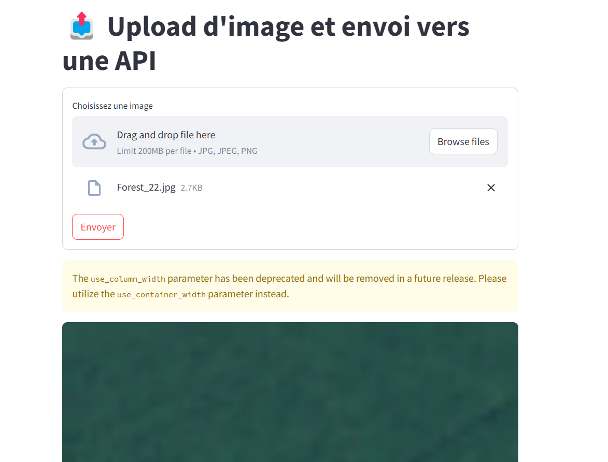

# 🛰️ Atelier CNN - Classification d'Images Satellites  

## **Création d’une Interface Web pour l’Upload d’Images avec Streamlit et API FastAPI**  

###**Introduction à Streamlit**  
[Streamlit](https://streamlit.io/) est un **framework Python** permettant de créer des applications web **interactives et intuitives** sans avoir besoin d’un développement frontend complexe. Il est particulièrement utile pour des **applications de Data Science, Machine Learning et IA**.  

**Pourquoi utiliser Streamlit ?**  
- **Simplicité** : Interface web rapide à mettre en place en quelques lignes de code.  
- **Intégration avec les API** : Permet de communiquer facilement avec des modèles d’IA via des requêtes HTTP.  
- **Visualisation** : Permet d'afficher facilement des **images, graphiques et données JSON**.  


---

### **Développement de l'application Streamlit**
Nous allons créer une **interface web** permettant à l’utilisateur de **téléverser une image** et de **l’envoyer à une API FastAPI** pour obtenir une **prédiction**.  


**Structure du projet**
```
📁 client
│── 📄 app.py             # Fichier principal Streamlit
│── 📄 config.py          # Contient l'URL de l'API
```

**Fichier `config.py`**
Ce fichier contient la configuration de l’API vers laquelle nous allons envoyer les images.  

```python
API_URL = "http://127.0.0.1:8081/predictions/satelite/"
```
Pensez à modifier cette URL si votre API tourne sur un autre serveur ou port.

**Fichier `app.py` (Application Streamlit)**
Voici le **code complet** pour l’interface web **Streamlit**.

```python
import streamlit as st
import requests
from config import API_URL

# Titre de l'application
st.title("📤 Upload d'image et envoi vers une API")

# Formulaire de dépôt de fichier
with st.form("upload_form"):
    uploaded_file = st.file_uploader("Choisissez une image", type=["jpg", "jpeg", "png"])
    submit_button = st.form_submit_button("Envoyer")

# Si le formulaire est soumis
if submit_button:
    if uploaded_file is not None:
        # Affiche l'image uploadée
        st.image(uploaded_file, caption="Image envoyée", use_column_width=True)
        
        # Prépare le fichier pour l'envoi à l'API
        files = {"file": (uploaded_file.name, uploaded_file, uploaded_file.type)}

        # Envoie la requête POST à l'API
        try:
            response = requests.post(API_URL, files=files)
            response.raise_for_status()  # Vérifie si l'API retourne une erreur HTTP

            # Affiche la réponse de l'API
            st.success("✅ Réponse de l'API :")
            st.json(response.json())

        except requests.exceptions.RequestException as e:
            st.error(f"❌ Erreur lors de la communication avec l'API : {e}")
    else:
        st.warning("⚠️ Veuillez sélectionner une image avant d'envoyer.")
```

**Lancer l’application Streamlit et l’API**
Avant de démarrer **Streamlit**, assurez-vous que votre **API FastAPI** est bien lancée.

**Démarrer l’API FastAPI**
Dans un terminal, lancez le serveur FastAPI avec **Uvicorn** :
```bash
uvicorn app.main:app --reload --host 0.0.0.0 --port 8081
```
**L'API sera accessible à l'adresse** : `http://127.0.0.1:8081/docs`

**Lancer l’application Streamlit**
Dans un autre terminal, exécutez :
```bash
streamlit run app.py
```
Ouvrez votre navigateur et accédez à : `http://localhost:8501`



## Navigation

