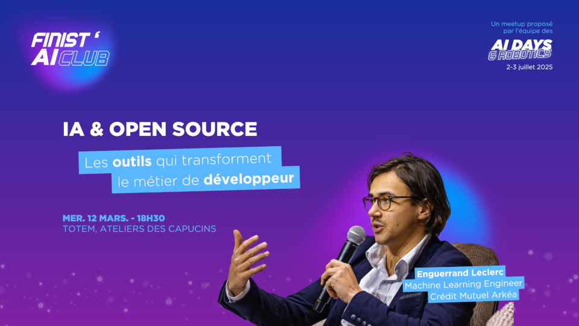
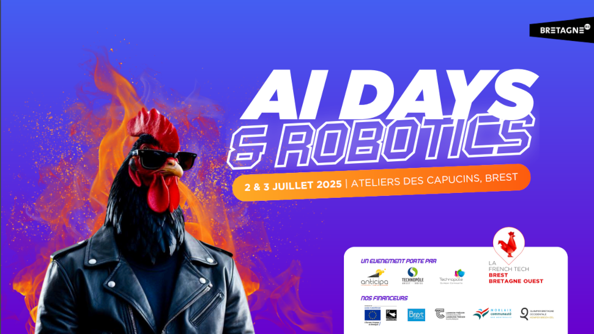
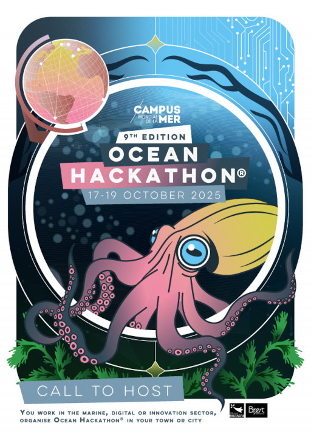

# 🛰️ Atelier CNN - Classification d'Images Satellites  

Les réseaux de neurones convolutifs (**CNN**) sont une des technologies utilisées dans l'analyse et le traitement des images. Grâce à cet atelier, vous allez découvrir **comment entraîner un modèle de deep learning** capable de classifier des **images satellites** en différentes catégories.  
Cet apprentissage pratique vous permettra de manipuler des données réelles et de concevoir une **solution complète**, de la préparation des données jusqu’au déploiement d’une **API permettant d’exploiter le modèle entraîné**.  

**📅 Durée : 2 jours** 

### **Intervenants :**  
- **Thomas Wentz** - Spécialiste AI Act, intervenant ISEN  
- **Stéphane Jamin-Normand** - Enseignant à l'ISEN, formateur référent de l'école IA

### **Cas concret : Classification d'images satellites**  
Lors de cet atelier, nous allons développer un modèle de **réseau de neurones convolutifs (CNN)** capable de classer des images satellites en **4 catégories** :  
- **Forêts**  
- **Mer**  
- **Désert**  
- **Nuageux**  

### **Objectifs pédagogiques**  
Au cours de ces deux journées, les participants apprendront à :  
- **Préparer les données** pour entraîner un CNN  
- **Développer un réseau CNN** adapté à la classification d'images 
- **Comprendre les enjeux étiques** sur l'explicabilité et le droit à l'image 
- **Construire une API** pour interagir avec le modèle entraîné  
- **Structurer les données** pour une meilleure exploitation

📌 Cet atelier est conçu pour être **pratique et immersif**, avec un focus sur un **cas d'usage réel** pour mieux comprendre l'application des réseaux de neurones convolutifs à la vision par ordinateur. 

### Déroulé de l'atelier
- [Chapitre 1 : introduction](https://github.com/Stephane-ISEN/atelierCNN/tree/ch1_intro)
- [Chapitre 2 : préparation des données](https://github.com/Stephane-ISEN/atelierCNN/tree/ch2_prepa_data)
- [Chapitre 3 : Le CNN à partir de zéro](https://github.com/Stephane-ISEN/atelierCNN/tree/ch3_cnn_zero)
- [Chapitre 4 : Finetuning d'un CNN](https://github.com/Stephane-ISEN/atelierCNN/tree/ch4_cnn_finetuning)
- [Chapitre 5: CNN accessible à travers une API Web](https://github.com/Stephane-ISEN/atelierCNN/tree/ch5_api)
- [Chapitre 6 : Conteneurisation d'une API avec un modèle CNN](https://github.com/Stephane-ISEN/atelierCNN/tree/ch6_docker)
- [Chapitre 7 : Un client pour consommer l'API](https://github.com/Stephane-ISEN/atelierCNN/tree/ch7_client)

### **Sur le territoire**

